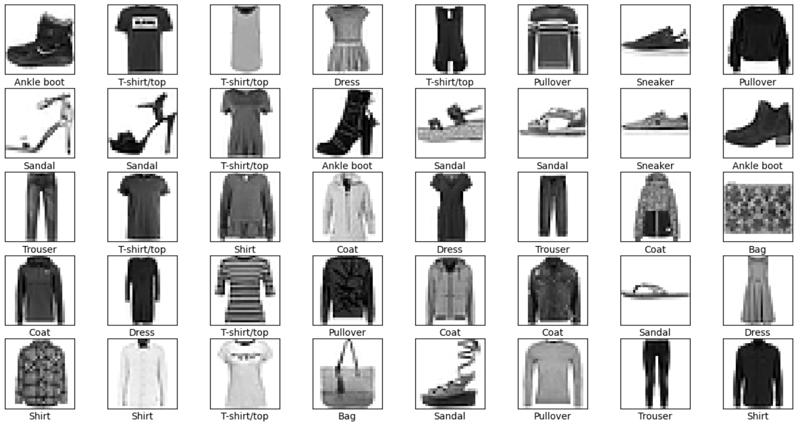
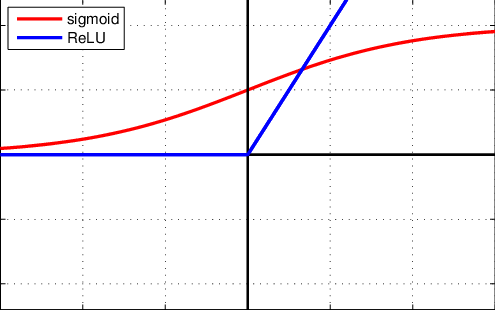
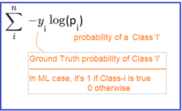
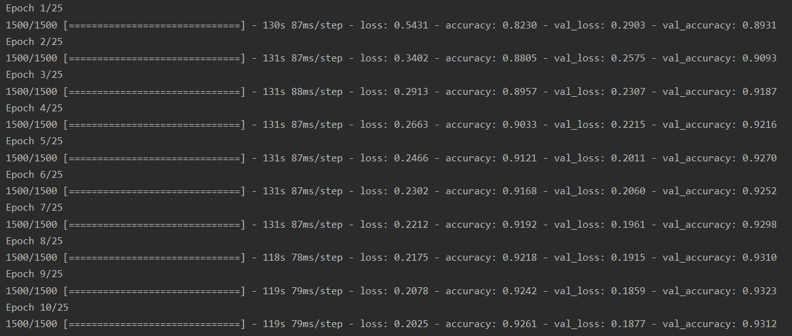
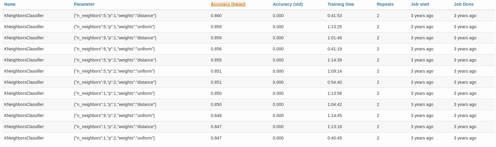
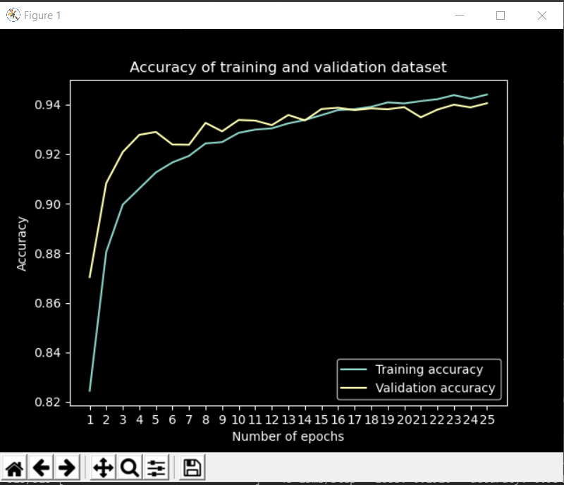
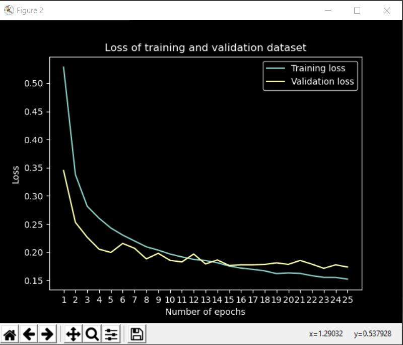
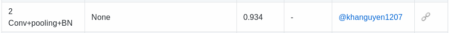

# Fashion-MNIST Recognition

## Table of contents
* [Introduction](#introduction)
* [Methods](#methods)
* [Results](#results)
* [Usage](#usage)

## Introduction
The goal of this project is Fashion-MNIST image classification.

Fashion-MNIST is a dataset of Zalando's article images. The dataset consists of:
* Training set of 60,000 examples
* Test set of 10,000 examples.

Each example is a 28x28 pixels greyscale image, associated with a label from 10 classes.

The classes are:
Label | Description
----- | -----------
0     | T-shirt/top
1     | Trousers
2     | Pullover
3     | Dress
4     | Coat
5     | Sandal
6     | Shirt
7     | Sneaker
8     | Bag
9     | Ankle boot

Here is and example of first 40 images in the training set:



Our goal is to develop a model which will classify images in a test set with the best accuracy.

My first attempt will be using a KNN - K Nearest Neighbors model with parameters:
* Distance function: Taxicab Metrics (also known as Manhattan Distance)
* Range of *k* parameter: [0..15]
* Weights: uniform - all distances are weighted equally

My second attempy will be making a CNN - Convolutional Neural Network with Tensorflow framework. The structure and parameters of the network are going to be described in *Methods* section.

Project is created mainly with:
* Python: 3.7.3
* Tensorflow: 2.2.0
* Matplotlib: 3.2.1

## Methods
### First model - KNN
K Nearest Neighbors is a discriminative and non-parametrix method which we can use for a classification problem like this one. In simple words, KNN is an algorithm which predicts the class of an object based on the distance between this object and other objects (for which we know the class). Distance is usually calculated differently, depending on the input data. For our problem, the data being vectors of pixels with value 0-255, we can use couple of different metrics, including:
* Manhattan Distance - takes the sum of the absolute values of the differences between objects
* Euclidean Distance - takes the square root of the sum of the squares of the differences between objects
* Chebychev Distance - takes the 'infinite root' of the sum of the squares of the differences between objects
* Cosine Distance
* Minkowski Distance

For my model, I decided on a Manhattan Distance, to speed up calculations a little.

KNN is usually quite a simple solution, but many times proves to be also quite effective. Let's look at the most important functions of this model.

```python
import matplotlib.pyplot as plt
import numpy as np
```

```python
def taxicab_metric(X, X_train):
    """
    Method returns a taxicab distance matrix, also known as Manhattan distance between two images
    """
    # Normalizing the data
    X = X / 255.
    X_train = X_train / 255.

    distance = np.empty((len(X), len(X_train)))

    for i in range(np.shape(X)[0]):
        distance[i] = np.sum(abs(X_train - X[i]), axis=1)
        if i % 100 == 0:
            print(100.*i/np.shape(X)[0], "%")   # Print progress every 1%

    return distance
```

Here we can see the exact calculation of the distance, which happens by taking an object from a test set and calculating differences between every pixel of this object and pixels of every object in a training set. Then these differences are summed up for each training object and stored in an array. We do it for every test object and in return, we get a matrix of distances between every test object and every training object. The return matrix is of size N1xN2 where N1 is number of images in test set and N2 is a number of training images.

What we need to do next is sort train labels in regards to distances in earlier calculated distance matrix. What we get in return is a matrix of class labels sorted by distance. This means that the first label in array for any given test image will be a label of an image which has the shortest distance to the test image.

```python
def sort_train_labels_knn(Dist, y):
    """
    Sorting training labels *y* in regards to distances in matrix *Dist*
    """
    indexes = np.argsort(Dist, kind='mergesort')
    return y[indexes]
```

After that, an algorithm will calculate a probability distribution of every label for every object in a test set. So what happens below is the function counts how many times a given label occured in *k* nearest neighbors and divides it by *k*. This is done for every label and in return we get a probability p(y|x) matrix for images from test set.

```python
def p_y_x_knn(y, k):
    """
    Calculating probability distribution p(y|x) of every label for every object
    in test dataset using KNN
    """
    classes = np.unique(y[0])
    p_y_x = []

    for y_row in y:
        counts = np.array([np.count_nonzero(y_row[0:k] == k_class) for k_class in classes])
        row = counts / k
        p_y_x.append(row)

    return np.array(p_y_x)
```

Result of the previous function is being send to the classification_error function, which calculates the error by counting the differences between the label with the most probability predicted by the KNN algorithm and the true label of a test image. Then, an average is taken from all differences and this is what is returned.

```python
def classification_error(p_y_x, y_true):
    """
    Calculating classification error
    """
    p_y_x_flipped = np.fliplr(p_y_x)
    args_max = len(p_y_x[0]) - 1 - np.argmax(p_y_x_flipped, axis=1)
    return np.mean(y_true != args_max)
```

All of the previous functions are coming together in this model selection function. This function checks the classification error for each *k* value of all the values given and chooses the best *k*, for which error is the lowest. The function returns the best (lowest) error, the best *k* value and list of all the errors for each *k*.

```python
def model_selection_knn(X_val, X_train, y_val, y_train, k_values):
    """
    Selecting the best *k* value for which value of classification error is the lowest

    Return:
    best_error: value of the lowest classification error
    best_k:     value of k for which error was the lowest
    errors:     list of error values for each k
    """
    best_err = 0
    best_k = 0
    errors = []

    distance_matrix = taxicab_metric(X_val, X_train)
    sorted_labels = sort_train_labels_knn(distance_matrix, y_train)

    for k in k_values:
        p_y_x = p_y_x_knn(sorted_labels, k)
        class_err = classification_error(p_y_x, y_val)
        errors.append(class_err)
        if class_err == min(errors):
            best_err = class_err
            best_k = k

    return (best_err, best_k, errors)
```

List of all the errors is then used to plot a simple function which shows the change in error with the change of parameter *k*.

```python
def plot_knn_errors(errors):
    """
    Plotting the errors of each *k* value
    """
    plt.style.use('dark_background')
    plt.plot(range(1, 15), (1-np.array(errors)), 'g')
    plt.legend(('Accuracy', ''))
    plt.ylabel('Accuracy')
    plt.xlabel('K Nearest Neighbors')
    plt.title("Accuracy for each *k* value")
    plt.draw()
    plt.show()
```

### Second model - CNN
For this model, I will be using a very powerful Python library: Tensorflow. I will try to explain everything while showing the methods. So firstly, let's look at the imports and important constants.

```python
import matplotlib.pyplot as plt
from sklearn.model_selection import train_test_split
from sklearn.metrics import classification_report
from tensorflow.keras.utils import to_categorical
from tensorflow.keras.models import Sequential
from tensorflow.keras.layers import Conv2D, MaxPooling2D, Dense, Flatten, Dropout, BatchNormalization
from tensorflow.keras.optimizers import SGD
from tensorflow.keras.losses import categorical_crossentropy

BATCH_SIZE = 32         # Size of one batch
NUM_OF_EPOCHS = 25      # Number of epoch to train the model
VAL_SPLIT = 0.2         # Validation set split ratio (20% of dataset will be validation)
LEARNING_RATE = 0.01    # Learning rate for Stochastic Gradient Descent
```

We are going to split the training dataset into training and validation set with the ratio 80%/20%, which means that 20% of our images are going to be used as validation set.
Learning rate is a constant for a Stochastic Gradient Descent algorithm which will be used as an optimizer in our convolutional neural network.

The first method of our NN is a preparation of a dataset:

```python
def prepare_dataset(x_train, y_train, x_test, y_test):
    """
    Preparing dataset: reshaping, normalizing, categorizing, splitting
    """
    x_train = x_train.reshape((x_train.shape[0], 28, 28, 1))
    x_test = x_test.reshape((x_test.shape[0], 28, 28, 1))

    x_train = x_train.astype('float32')
    x_test = x_test.astype('float32')
    x_train = x_train / 255.
    x_test = x_test / 255.

    y_train = to_categorical(y_train, LABELS_COUNT)
    y_test = to_categorical(y_test, LABELS_COUNT)

    x_train, x_val, y_train, y_val = train_test_split(x_train, y_train, test_size=VAL_SPLIT, random_state=2018)

    return x_train, y_train, x_val, y_val, x_test, y_test
```

Firstly, we reshape our flatten vectors of pixels to 28x28 matrixes and normalize data, so that every pixel has a float value between 0 and 1. Then we categorize labels, so instead of a number, we have an array of zeros and ones on specific places.

For example, if the first label has a value "4", it will now be changed to an array which looks like this:

(0, 0, 0, 1, 0, 0, 0, 0, 0, 0)

Then we see the method which splits our data and finally we return a data, ready to be used and trained on. So here is where the fun begins:

```python
def cnn_model():
    """
    Building a Sequential model, displaying its statistics at the end
    """
    # First set of 2 * Convolutional layers
    model = Sequential()
    model.add(Conv2D(32,
                     kernel_size=(3, 3),
                     activation='relu',
                     padding='same',
                     kernel_initializer='he_normal',
                     input_shape=(28, 28, 1)))
    model.add(BatchNormalization())
    model.add(Conv2D(32,
                     kernel_size=(3, 3),
                     activation='relu',
                     padding='same'))
    model.add(BatchNormalization(1))
    model.add(MaxPooling2D(pool_size=(2, 2)))
    model.add(Dropout(0.25))

    # Second set of 2 * Convolutional layers
    model.add(Conv2D(64,
                     kernel_size=(3, 3),
                     activation='relu',
                     padding='same'))
    model.add(BatchNormalization())
    model.add(Conv2D(64,
                     kernel_size=(3, 3),
                     activation='relu',
                     padding='same'))
    model.add(BatchNormalization())
    model.add(MaxPooling2D(pool_size=(2, 2)))
    model.add(Dropout(0.25))

    # One regular, dense hidden layer with size of 512
    model.add(Flatten())
    model.add(Dense(512,
                    activation='relu'))
    model.add(BatchNormalization())
    model.add(Dropout(0.5))

    # Last layer with 10 neurons representing labels
    model.add(Dense(LABELS_COUNT,
                    activation='softmax'))

    opt = SGD(lr=LEARNING_RATE, momentum=0.9, decay=LEARNING_RATE/NUM_OF_EPOCHS)

    model.compile(loss=categorical_crossentropy,
                  optimizer=opt,
                  metrics=['accuracy'])

    model.summary()

    return model
```

First of all, our model is using a Sequential API, which allows us to create this model layer-by-layer. 

Here is the short explanation of our model structure:
* Convolutional Layer - tranforms recieved input with kernel filter sliding and applying it across every image. The kernel filter in our case has a size of 3x3. Abstractly speaking, using filters, Convolutional Layer tries to detect patterns in an image.
* Batch normalization - increases stability of our neural network and reduces overfitting by normalizing the output of the previous layer in a similiar way to how we normalized data in a function before that. Batch normalization reduces the amount by which the hidden layer values shift. It reduces the number of epochs needed to achieve great accuracy but makes every epoch time much longer.
* Dropout Layer - is a form of regularization that prevents overfitting by ignoring random neurons during training.
* Pooling Layer - prevents 'remembering' positions of patterns detected by Convolutional Layer by downsampling the image so that it contains just the important feature.
* Dense Layer - regular layer of a neural network. Word dense means that every neuron from previous layer is connected to every input in this layer.

As an activation function, I decided to use 'ReLU' witch proves to be a bit better than well-known 'sigmoid' function.



As an optimizer for this model, I decided to use Stochastic Gradient Descent with specific parameters. SGD is an algorithm used to minimize functions by iteratively moving in the steepest descent.

As a Loss Function I am going to use Cross-Entropy, which is defined like this:



In the end, our model summary looks like this:

```python
Model: "sequential"
_______________________________________________________________
Layer (type)                 Output Shape              Param #   
=================================================================
conv2d (Conv2D)              (None, 28, 28, 32)        320       
_______________________________________________________________
batch_normalization (BatchNo (None, 28, 28, 32)        128       
_______________________________________________________________
conv2d_1 (Conv2D)            (None, 28, 28, 32)        9248      
_______________________________________________________________
batch_normalization_1 (Batch (None, 28, 28, 32)        128       
_______________________________________________________________
max_pooling2d (MaxPooling2D) (None, 14, 14, 32)        0         
_______________________________________________________________
dropout (Dropout)            (None, 14, 14, 32)        0         
_______________________________________________________________
conv2d_2 (Conv2D)            (None, 14, 14, 64)        18496     
_______________________________________________________________
batch_normalization_2 (Batch (None, 14, 14, 64)        256       
_______________________________________________________________
conv2d_3 (Conv2D)            (None, 14, 14, 64)        36928     
_______________________________________________________________
batch_normalization_3 (Batch (None, 14, 14, 64)        256       
_______________________________________________________________
max_pooling2d_1 (MaxPooling2 (None, 7, 7, 64)          0         
_______________________________________________________________
dropout_1 (Dropout)          (None, 7, 7, 64)          0         
_______________________________________________________________
flatten (Flatten)            (None, 3136)              0         
_______________________________________________________________
dense (Dense)                (None, 512)               1606144   
_______________________________________________________________
batch_normalization_4 (Batch (None, 512)               2048      
_______________________________________________________________
dropout_2 (Dropout)          (None, 512)               0         
_______________________________________________________________
dense_1 (Dense)              (None, 10)                5130      
=================================================================
Total params: 1,679,082
Trainable params: 1,677,674
Non-trainable params: 1,408
```

**Disclaimer**

All the parameters and the structure of the model itself were heavily inspired by mainly two influential websites:
* https://www.pyimagesearch.com/2019/02/11/fashion-mnist-with-keras-and-deep-learning/
* https://www.kaggle.com/gpreda/cnn-with-tensorflow-keras-for-fashion-mnist
* BUT also by many hours of testing and researching on my part

**Brief history of creation**

At first, this model looked much simpler and was much faster. It consisted of two Convolutional Layers and two Dense Layers without any Dropout or Batch Normalization Layers and was giving the results of about 89% accuracy. Then, after many hours of testing and improving, it developed to the complicated structure it has now. I believe it can still be better, but I'm very, very proud of it. The only downside of this model is the learning speed which happens to be around an hour. Previous, simpler model took only 10 minutes.

**End of digression, more in the *Results* section**

Finnaly, we have a function which puts the model to the test:

```python
def run_model(model, X_train, y_train, X_val, y_val, X_test, y_test, class_names):
    """
    Training the model with parameters at the beginning, then displaying
    test score and classification report
    """
    train_model = model.fit(X_train, y_train,
                            batch_size=BATCH_SIZE,
                            epochs=NUM_OF_EPOCHS,
                            verbose=1,
                            validation_data=(X_val, y_val))
    print()
    predictions = model.predict(X_test)
    print(classification_report(y_test.argmax(axis=1), predictions.argmax(axis=1), target_names=class_names))

    score = model.evaluate(X_test, y_test, verbose=1)
    print("\nTest loss: {:.3f}".format(score[0]))
    print("Test accuracy: {:.3f}\n".format(score[1]))

    return train_model
```

Here we train our model with previously specified parameters. I used a convinient function *classification_report* which gives a better view on scores than just an accuracy number. However, the accuracy number is still probably the most important and it's what we're waiting for.

Here is just a part of model training:



To show our data a little better, we plot functions showing the accuracy and loss, of both training and validation set, in regards to the number of epochs.

```python
def plot_model_evaluation(train_model):
    """
    Plotting some results from training the model
    """
    history = train_model.history

    train_acc = history['accuracy']
    val_acc = history['val_accuracy']

    plt.style.use("dark_background")

    plt.figure()
    plt.plot(range(1, NUM_OF_EPOCHS+1), train_acc)
    plt.plot(range(1, NUM_OF_EPOCHS+1), val_acc)
    plt.xlabel("Number of epochs")
    plt.ylabel("Accuracy")
    plt.legend(["Training accuracy", "Validation accuracy"])
    plt.title("Accuracy of training and validation dataset")
    plt.draw()
    plt.waitforbuttonpress()

    train_loss = history['loss']
    val_loss = history['val_loss']

    plt.figure()
    plt.plot(range(1, NUM_OF_EPOCHS+1), train_loss)
    plt.plot(range(1, NUM_OF_EPOCHS+1), val_loss)
    plt.xlabel("Number of epochs")
    plt.ylabel("Loss")
    plt.legend(["Training loss", "Validation loss"])
    plt.title("Loss of training and validation dataset")
    plt.draw()
    plt.waitforbuttonpress()
```

## Results
This is the best part, showing off!

### KNN

Firstly, I would like to present the results of my KNN model.


Classyfing my KNN model to compare with Fashion-MNIST benchmark:

Name                | Parameter                                     | Accuracy (mean) | Training time
------------------- | --------------------------------------------- | --------------- | -------------
KNeighborsClassifier| {"n_neighbors":5, "p":1, "weights":"uniform"} | 0.8596          | some_tiem

And here is the benchmark part with KNN models:



As for my understanding, parameters mean:
* n_neighbours: best *k* value
* p: distance used (p=1 - manhattan, p=2 - euclidean)
* weights: "uniform" - means that all the distances are weighted equally, "distance" - means that neighbors are weighted by their distance to given object

### CNN

I would like to present the results of my CNN model.

Accuracy on Test Set | Loss on a Test Set  | Training time
-------------------- | ------------------- | --------------
0.934                | 0.191               | 00:57:12.07




What is quite surprising but also understandable is that my CNN produced the same result that one of the results in benchmark on Fashion-MNIST github:



This entry is named "2 Conv+pooling+BN" which means 2 layers of Convolutional Network + Pooling + BatchNormalization which is exactly what I've done in my CNN. That is why the result matches almost exactly the entry.

## Usage
Usage of this code is quite simple. After cloning the repository and installing all the required libraries, it is enough to run **main.py**

```bash
python3.7 main.py
```

In order to train/test only one of the models, commenting one of the secion in **main.py** is going to be enough:

```python
if __name__ == "__main__":

    show_sample_dataset()

    print("\n---------------")
    print("| RUNNING KNN |")
    print("---------------")
    knn_algorithm()

    print("\n--------------------------")
    print("| RUNNING CNN TENSORFLOW |")
    print("--------------------------")
    cnn_tensorflow()
```


## Sources
These are the sources which helped me understand and develop a great intuition for neural networks and different ML models:
* https://www.ii.pwr.edu.pl/~zieba/RO_W5.pdf
* https://medium.com/@RaghavPrabhu/understanding-of-convolutional-neural-network-cnn-deep-learning-99760835f148
* https://www.pyimagesearch.com/2018/12/31/keras-conv2d-and-convolutional-layers/
* https://www.kaggle.com/gpreda/cnn-with-tensorflow-keras-for-fashion-mnist
* https://youtu.be/IHZwWFHWa-w
* https://www.youtube.com/watch?v=YRhxdVk_sIs
* Testing, training, experimenting

## License
This is a project done for a subject, tought by [dr. inż. Maciej Zięba](https://www.ii.pwr.edu.pl/~zieba/) on [Wroclaw University Of Science and Technology](https://pwr.edu.pl/)